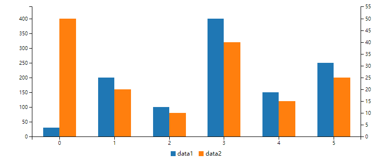

# mdbook-chart
A preprocessor and cli tool for mdbook to show chart use C3.js.

#### install

```bash
cargo install mdbook-chart
```

#### 1. Use as mdbook preprocessor.

```bash
#cat /path/to/your/mdbook/book.toml

[book]
authors = []
language = "en"
multilingual = false
src = "src"

[build]
create-missing = false

#use as mdbook preprocessor
[preprocessor.chart]

[output.html]
additional-js = ["assets/d3/d3.min.js", "assets/c3/c3.min.js"]
additional-css = ["assets/c3/c3.min.css"]

[output.html.fold]
enable = true
level = 0

```

### 2. edit your markdown file
````text

```chart
{
    "data": {
        "type": "bar",
        "columns": [
            ["data1", 30, 200, 100, 400, 150, 250],
            ["data2", 50, 20, 10, 40, 15, 25]
        ],
        "axes": {
            "data2": "y2"
        }
    },
    "axis": {
        "y2": {
            "show": true
        }
    }
}
```

or 


{
    "data": {
        "type": "foo",
        "columns": [
            ["data1", 30, 200, 100, 400, 150, 250],
        ["data2", 50, 20, 10, 40, 15, 25]
        ],
        "axes": {
            "data2": "y2"
        }
    },
    "axis": {
        "y2": {
            "show": true
        }
    }
}


````


When you run 
```bash
mdbook serve
```
Or
```bash
mdbook build
```
this will do something to make sure your chart show as you wish.




